# macOS 的 VSCode 配置 C/C++ 环境

## 一、下载相关
### 1. VSCode
（1）官网：[Visual Studio Code](https://code.visualstudio.com/)

### 2. 扩展包
（1）VSCode
  - 点击VSCode的扩展；
  - 搜索“C/C++”和“CodeLLDB”，并点击下载。
  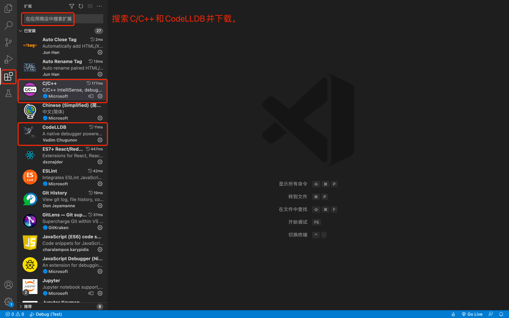
  
（2）CodeLLDB可能由于网络问题安装失败。可选择其他下载方式：
  - GitHub：[vscode-lldb](https://github.com/vadimcn/vscode-lldb/releases)
    > 基于Intel的Mac选择：codelldb-x86_64-darwin.vsix
    > 基于Apple Silicon的Mac选择：codelldb-aarch64-darwin.vsix
  
    下载完成后，在扩展中点击“从VISX安装”，选择对应的 `.vsix` 文件，即可。
  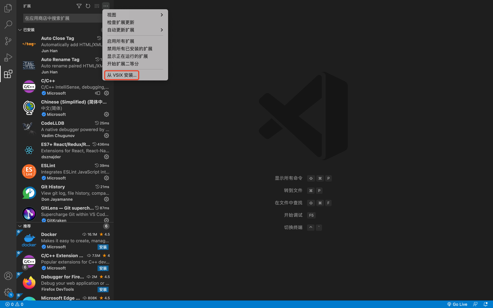
  - 百度云网盘分享：
    > 链接: https://pan.baidu.com/s/161ZDiXmCjPCetZoaOpYIRA
    > 提取码: 781s

---

## 二、步骤相关
1. 打开自己的项目，并新建一个 `main.c` 文件，简单代码如下图所示：
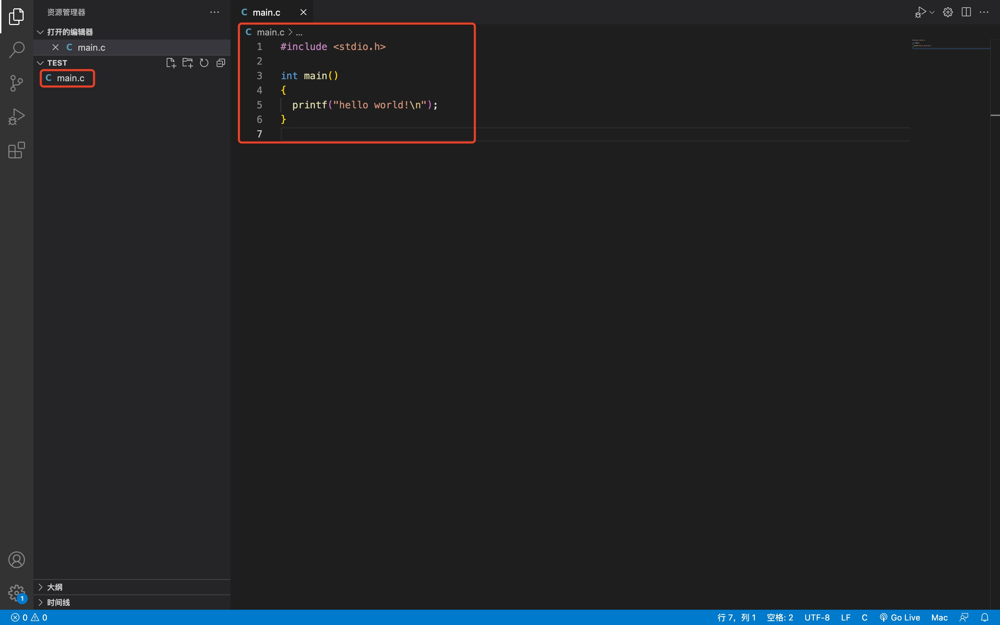

2. 运行——添加配置，选择 `LLDB` ，如下图所示：
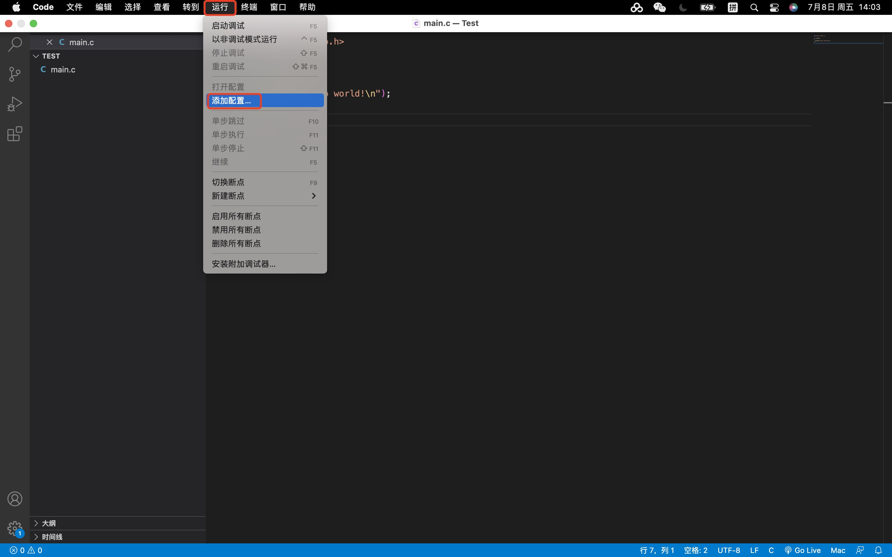
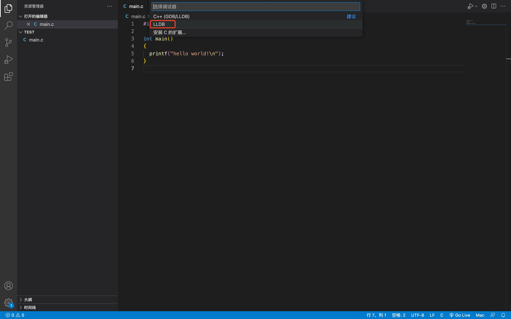

3. 此时，项目中新增 `launch.json` 文件，其中，第11行代码的 `program` 参数的值需改为 `${fileDirname}/${fileBasenameNoExtension}` ，如下图所示：
相关文档：[Visual Studio Code Variables Reference](https://code.visualstudio.com/docs/editor/variables-reference)
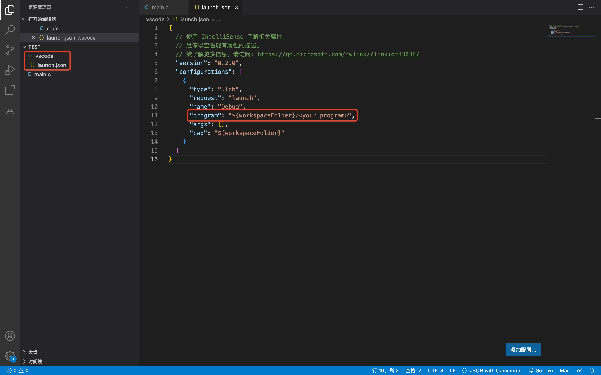
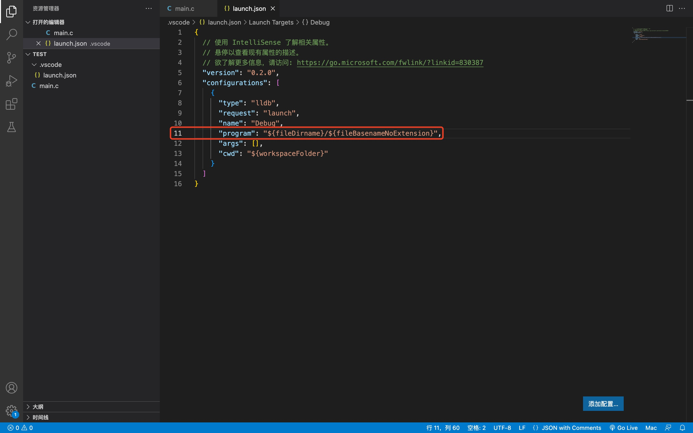

4. 终端——运行生成任务，选择 `C/C++：gcc生成活动文件` （在当前需要运行的文件下执行这一步，比如这边是 `main.c` 文件下），如下图所示：
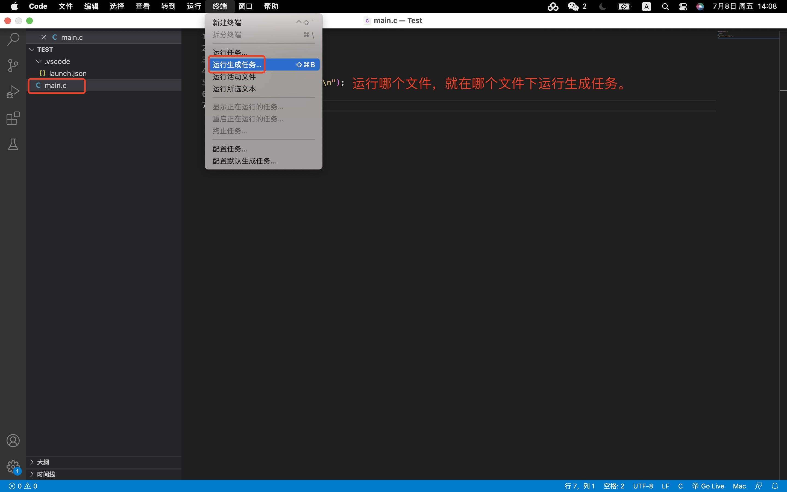
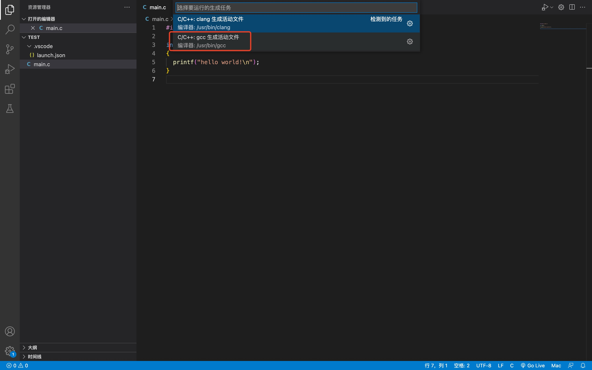

5. 再按下`fn` + `F5`，终端成功输出 `hello world!`，如下图所示：
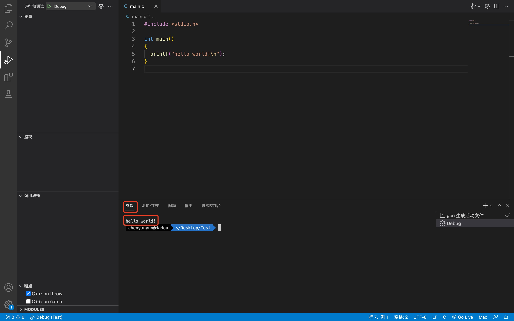

6. Debug之前都要先运行生成任务，如果不想每次都手动执行，可以执行：终端——配置默认生成任务，如下图所示：
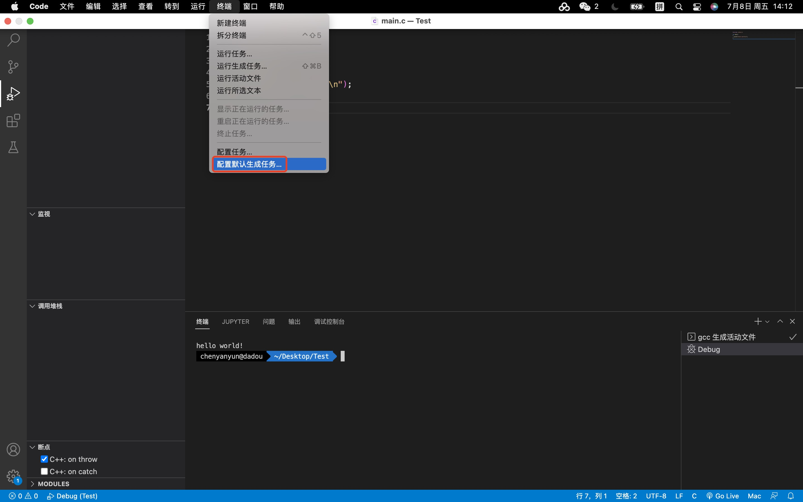
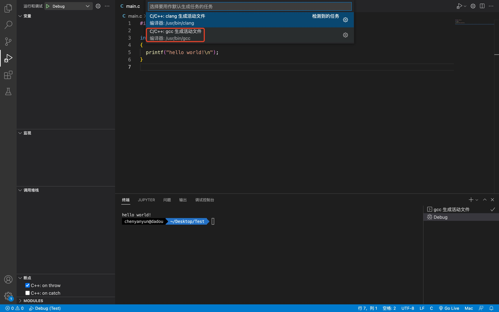

7. scanf函数也可正常使用，如下图所示：
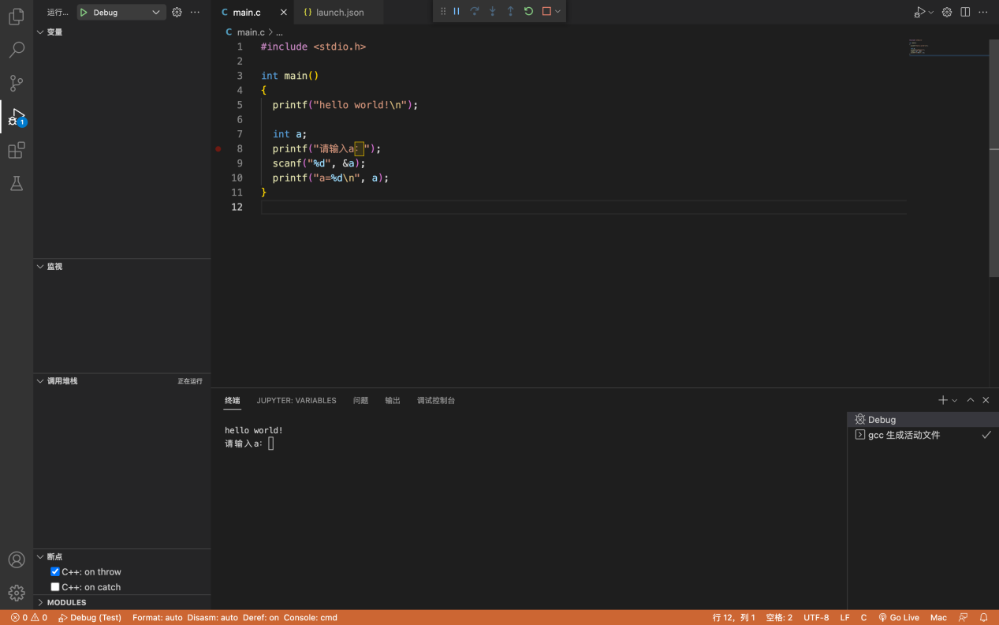
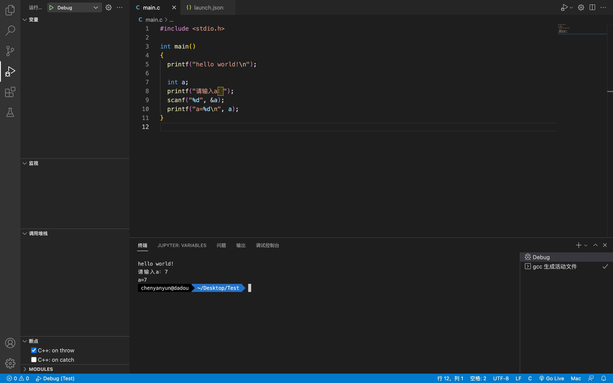