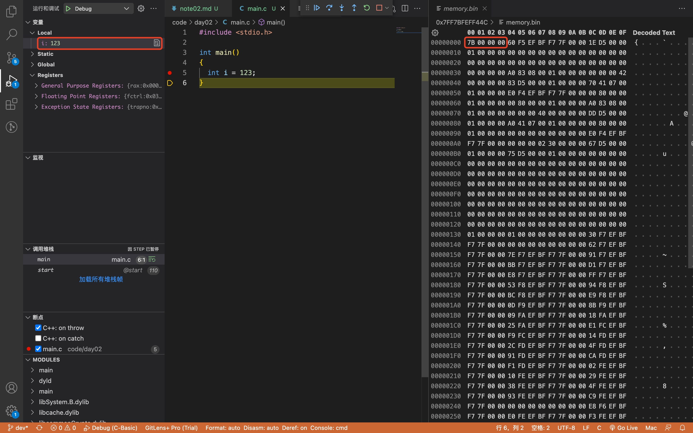
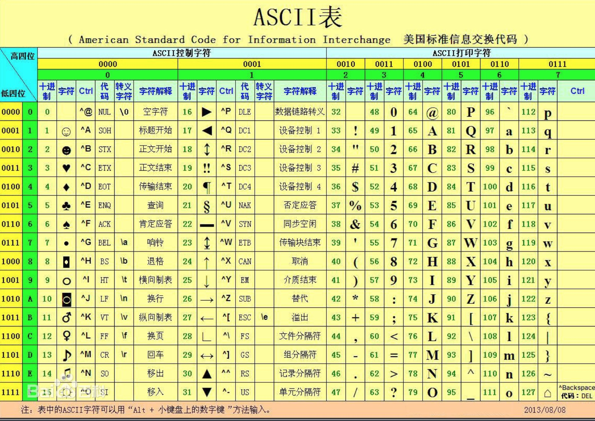

[🔙 返回](../README.md)

# 进制转换相关

> - 二进制（0和1）
> - 十进制（0-9）
> - 八进制（0-7）
> - 十六进制（0-9, a-f） 

## 1. 关于整数的进制转换

### 1.1 举个例子🌰

  十进制 | 二进制   | 八进制 | 十六进制  
  :---  | :---    | :---  | :---  
  123   | 1111011 | 173   | 7B  

其中， 
> 八进制 173 可由二进制 1 111 011 直接计算得出； 
> 十六进制 7B 可由二进制 111 1011 直接计算得出。

### 1.2 观察内存使用的十六进制
  
  对于十六进制数 7B：

  - 00 00 00 7B 在这边内存看到的是 7B 00 00 00，如下图所示；
  - 这是因为：x86 架构是小端存储（Intel / AMD），即低位在前，高位在后。相反的，大端存储为高位在前，低位在后。
  - TODO: 具体的再看一下计算机组成原理，补充一下大小端模式内容。  
  

  - 查看 memory 使用 Hex Editor 插件。 
  

## 2. 单位换算

字符   | 说明
:---  | :--- 
bit   | 位（0和1）
Byte  | 字节

- 1B (Byte) = 8 bit
- 1KB = 1024B = 2^10B
- 1MB = 1024KB = 2^10KB
- 1GB = 1024MB = 2^10MB

<!-- 
  md输出上下标：
    1. 上标 2^10^
    2. 下表 a~0~ 
  然而，这个不适用上传到 github 中的 md 文件。
-->

> 特别的，磁盘中是1GB = 1000 000 000 字节 = 10^9 字节

- `int` 占用 4 个字节
- `float` 占用 4 个字节
- `char` 占用 1 个字节
- `short` 占用 2 个字节

## 3. ASCII码
- ASCII码表（部分）  

- 常用

  十进制|字符
  ---|---
  32 |(space)
  48 |0
  57 |9
  65 |A
  90 |Z
  97 |a
  122|z
